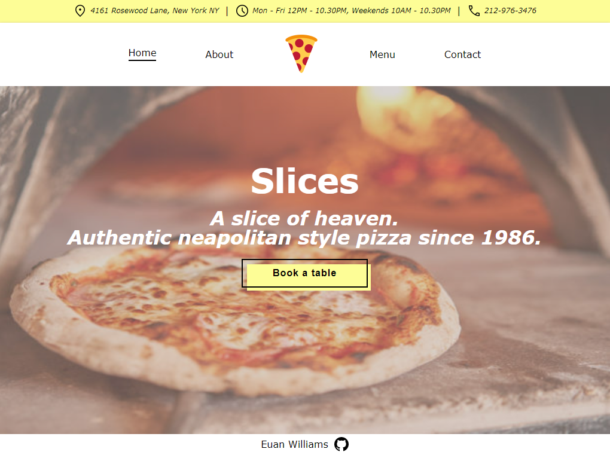

# restaurant-page
[Live Demo](https://euanrw.github.io/restaurant-page/) :point_left:  
A restaurant page to demonstrate webpack knowledge.

## Objectives
- [X] Gain a greater understanding of webpack by loading assets and managing output.
- [X] Demonstrate code-splitting knowledge by organising code into modules.
- [X] Use DOM manipulation to dynamically render a webpage.

## Project Status
Complete (Mostly)

## Project Screen Shot(s)

## Installation and Setup Instructions

- Clone Github repo down.
- Run `npm i` to install depenencies.
- Run `npm run start` to start dev server.